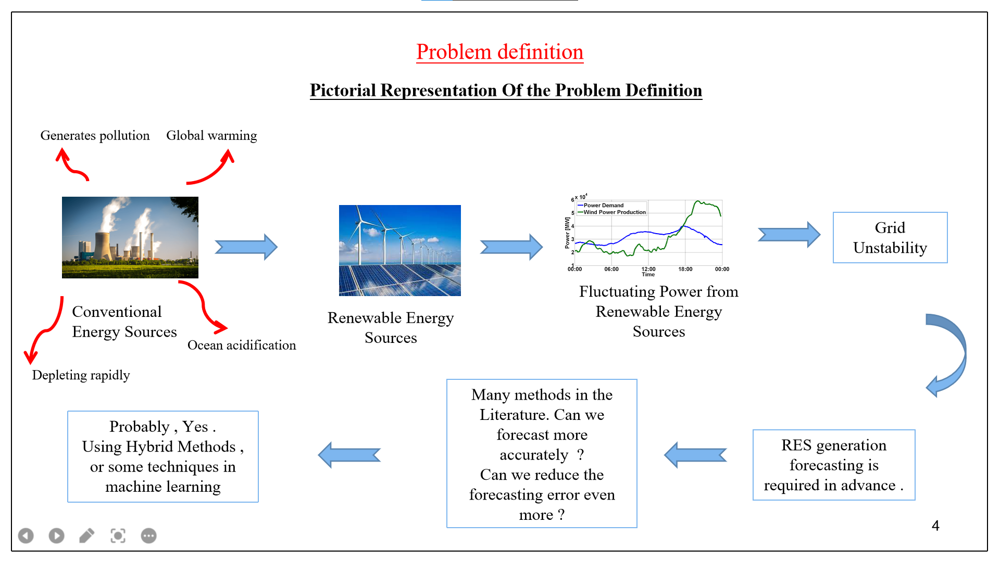

# Solar Energy Generation Forecasting Using Machine Learning and its Deployability
---
## Problem definition
- Due to ever growing demand of energy by modern society , depleting non-renewable energy sources and the changing climatic conditions has led to a growing usage and deployment of renewable energy systems to harness the energy sources which are available in abundant quantities in nature . 

- However , harnessing the renewable energy sources and its integration into the grid possess few challenges which must be overcome . The renewable sources of energy are affected by environmental conditions , like wind speed , solar radiation , temperature , humidity of air ,etc ) which causes fluctuation in energy generated using these sources .

- The smooth functioning of a grid is possible if the energy generated using these sources are predicted in advance with accuracy . Although many predictive machine learning models exist today , their accuracy can still be improved using techniques known today while training these models and also before the training stage .

- The accuracy of various existing deep learning models / hybrid models can be improved using various techniques known today .The main focus here would be to try various techniques to improve the accuracy of various existing deep learning models / hybrid models and work on the deployment aspect of these models in the cloud platforms .
 
 ---
 ## Objectives of the Project
 
- To improve the accuracy of the existing state of the art hybrid method in deep learning techniques for renewable energy forecasting .

- To deploy deep learning models / hybrid models for renewable energy forecasting on cloud platforms , like Heroku cloud platform , Amazon Web Services , etc .
---

